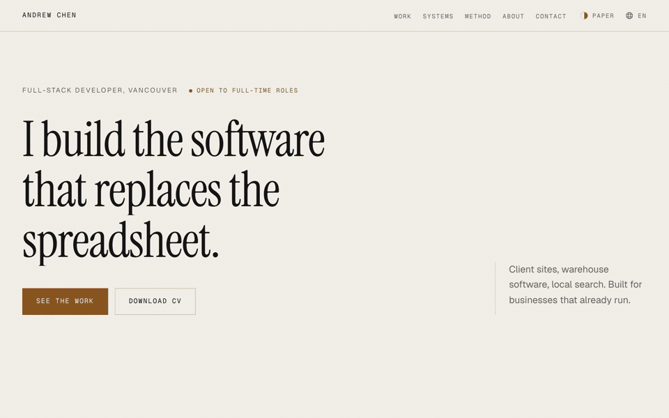
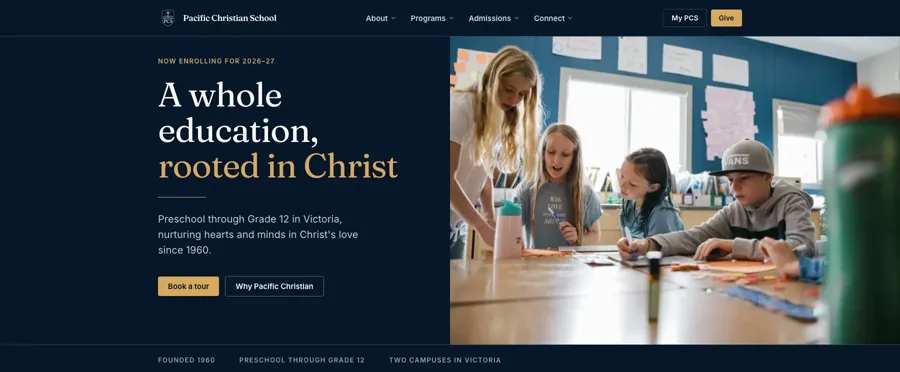
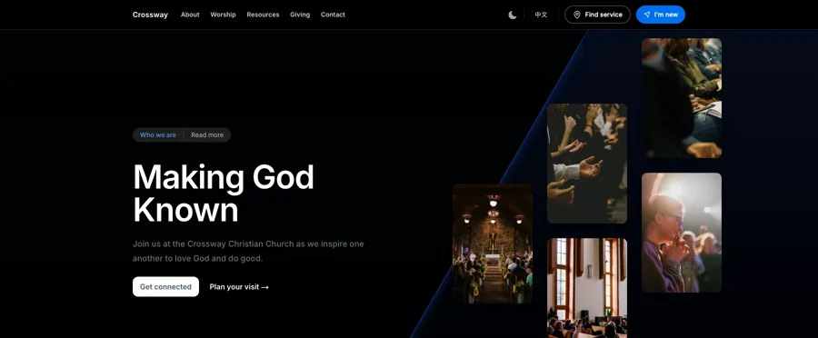
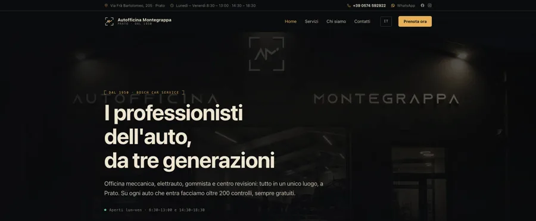

<h2 align="center">Andrew Chen</h2>

<p align="center">
  Full-stack engineer building AI-assisted systems for small businesses
  <br>
  <sub>Vancouver · working with clients across Europe and North America</sub>
</p>

<p align="center">
  
  
  
  
  
  
  
  
</p>

---

<p align="center">
  <a href="https://personal-portfolio-vert-two.vercel.app/">
    
  </a>
</p>

<p align="center">
  <b>One page, three complete design systems.</b> Not a dark-mode toggle with a second palette —
  <br>
  each changes the colour set, the typeface doing the headline work, the type scale, and the
  <br>
  shape of every section. A visitor switches between them live.
  <a href="https://personal-portfolio-vert-two.vercel.app/">Try it →</a>
</p>

<br>

### Client work

Click either of the first two screenshots to open the live site.

<table>
<tr valign="top">
<td width="33.3%">
  <a href="https://pacific-christian.vercel.app/"></a>
</td>
<td width="33.3%">
  <a href="https://crossway-christian-church.vercel.app/en"></a>
</td>
<td width="33.3%">
  
</td>
</tr>
<tr valign="top">
<td>
  <b><a href="https://pacific-christian.vercel.app/">Pacific Christian School</a></b><br>
  <sub>18 pages, 5 layout families. First-load JS <b>165 → 111 kB</b>, and the CSS from 91 hand-written rules to 11.</sub>
  <br><br>
  <sub><code>Next.js</code> <code>TypeScript</code> <code>Tailwind</code></sub>
</td>
<td>
  <b><a href="https://crossway-christian-church.vercel.app/en">Crossway Christian Church</a></b><br>
  <sub>Bilingual — 9 routes × 2 locales, 928 translated strings. Layout holds at <b>11 / 11</b> widths, 1600px down to 390px.</sub>
  <br><br>
  <sub><code>Next.js</code> <code>HeroUI</code> <code>next-intl</code></sub>
</td>
<td>
  <b>Autofficina Montegrappa</b><br>
  <sub><b>Preview, not yet live.</b> 6 routes × 3 locales, <b>29 kB</b> of JavaScript in total, <b>zero</b> dependencies and no build step.</sub>
  <br><br>
  <sub><code>Hand-written HTML</code> <code>CSS</code> <code>Vanilla JS</code></sub>
</td>
</tr>
</table>

<sub>Autofficina carries a real business's name, address and VAT number and has not been bought yet, so it ships <code>noindex</code> three ways and is deliberately not linked from here — a second indexed site would compete with the owner's own listing.</sub>

<br>

### The rest is private

Client systems and commercial work, so here is the shape of it instead.

**Warehouse operations** — Multi-tenant WMS covering receiving, putaway, picking and
allocation, built for a wholesale floor where operators move faster than they can type.
Search is the killer feature; everything else bends around it.

**AI imagery pipeline** — Garment photography → on-model editorial imagery at scale.
The generative step is wrapped in deterministic pre- and post-processing, because
reproducibility matters more than novelty when the output is a client deliverable.

**Local-SEO automation** — Content engine for small-business Google Business Profiles:
brand-locked imagery, category taxonomy, posting playbooks, and per-client credibility
sites that are designed fresh rather than stamped from a template.

**Agent tooling** — Cost-aware multi-model orchestration. Frontier models plan and
verify; cheaper models execute behind deterministic gates. Every routing rule in it
had to survive a real before/after measurement — several didn't, and got deleted.

### How I work

- Deterministic checks before model judgment — a compiler exit code costs nothing and doesn't hallucinate
- Measure before mutating; a plausible optimization that loses an A/B is still a loss
- Every figure on a page I ship carries a note on how it was obtained, or it does not go on the page
- Ship the boring version first, then earn the complexity

### Currently

Designing a visual feedback loop for AI-assisted web development — point at any element,
on any page, across a whole site, and hand the model a precise visual brief instead of
a paragraph of description.

<br>

<details>
<summary><sub><b>How the theme GIF above was made</b> — notes to myself, because I will forget</sub></summary>

<br>

The three frames are real loads of the deployed site, not a screen recording. The theme is
written to `localStorage` and the page is then loaded fresh, which is the path a returning
visitor takes — so what lands in the frame is the theme the inline `<head>` script applies
*before first paint*, rather than a React repaint caught mid-transition. Each shot asserts
`data-theme` came back as the one that was asked for before it is kept.

```sh
# headless Chrome on 9355, then one navigation per theme
"/Applications/Google Chrome.app/Contents/MacOS/Google Chrome" \
  --headless=new --disable-gpu --remote-debugging-port=9355 --user-data-dir=/tmp/cdp &
node shoot-themes.mjs https://personal-portfolio-vert-two.vercel.app .
pkill -f "remote-debugging-port=9355"
```

The crossfades are composed afterwards, so the timing is controllable and the loop is
seamless — the last segment fades back into the first frame:

```sh
ffmpeg -loop 1 -t 2.05 -i theme-paper.png -loop 1 -t 2.05 -i theme-instrument.png \
       -loop 1 -t 2.05 -i theme-poster.png -loop 1 -t 0.50 -i theme-paper.png \
  -filter_complex "\
[0]scale=960:-2,fps=12,setsar=1[a];[1]scale=960:-2,fps=12,setsar=1[b];\
[2]scale=960:-2,fps=12,setsar=1[c];[3]scale=960:-2,fps=12,setsar=1[d];\
[a][b]xfade=transition=fade:duration=0.45:offset=1.60[ab];\
[ab][c]xfade=transition=fade:duration=0.45:offset=3.20[abc];\
[abc][d]xfade=transition=fade:duration=0.45:offset=4.80[out];\
[out]split[s0][s1];[s0]palettegen=max_colors=96:stats_mode=diff[p];\
[s1][p]paletteuse=dither=bayer:bayer_scale=4" theme-switch.gif
```

`stats_mode=diff` builds the palette from what changes between frames rather than from the
whole image, which is what keeps 96 colours from banding the pale theme. 1.5 MB.

</details>
